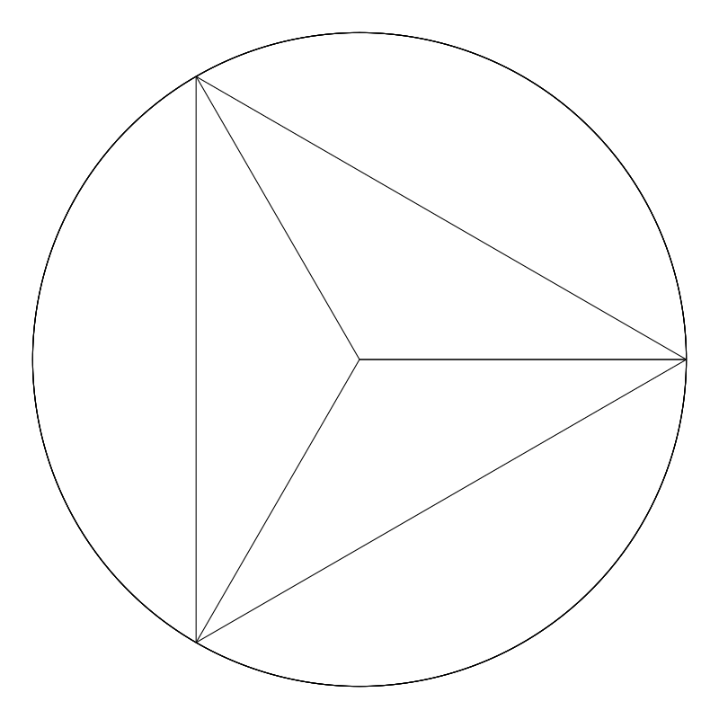

```{r setup, include=FALSE}
library(tufte)
library
# invalidate cache when the tufte version changes
knitr::opts_chunk$set(cache.extra = packageVersion('tufte'))
options(htmltools.dir.version = FALSE)
```

# Outline

-   The essentials

-   Numerical approximations

    -   Approximating $\pi$

    -   What do you **mean**?

-   Simulating ecology

    -   Ecological communities

    -   Population growth

    -   Coupled differential equations

```{r, echo = FALSE, include = FALSE, message = FALSE}
library(ggplot2)
library(dplyr)
library(tidyr)
library(emo)
```

# The essentials

*Note: If you have some basic programming experience then this section is really just a review.*

There are only a couple things you will need to run a simulation: 1) generate a sequence of numbers, 2) have some way to store data, 3) be able to manipulate that data, and 4) have **imagination** `r ji("smile")`

## Sequence of numbers

Before any simulation can happen, we need to a generate some numbers or a range of numbers. Think about it as the "spacetime" or canvas in which the reality of your simulation unfolds. Often times this is a sequence of ordered integers or a random sequence of numbers drawn from some probability distribution.

These are the commonly used functions that you can to generate such numbers in R:

-   **Ordered sequence**: seq()

-   **Random sequence**

    -   Uniform distribution: runif()

    -   Normal distribution: rnorm()

Examples

```{r}
seq(from = 1, to = 10, by = 2)
runif(n = 5, min = 0, max = 1)
rnorm(n = 5, mean = 5, sd = 1)
```

## 2. Storing your data

Once we have generated some numbers and also when we run the actual simulation, we need to have some way to store the data.

In R, the commonly used data structures are:

-   **Vectors** - a sequence of items of the same type (integers, numerics, characters)

    ```{r}
    vec <- c(1, 2, 3)
    vec
    ```

-   **Matrices** or Arrays - generalization of vectors in multiple dimensions

    ```{r}
    mat <- matrix(data = 1:9, nrow = 3, ncol = 3)
    mat
    ```

-   **Data frames** - a collection of variables organized in a table. Each column is a variable and each row is an observation/datum

    ```{r}
    df <- data.frame(varA = c(1, 5, 10), varB = c('blue', 'red', 'green'))
    df
    ```

-   **Lists** - the "meta" data structure, can store objects of any type. Can be a list of lists, a list vectors, list of dataframes, or a list of different combinations of data structures!

    ```{r}
    list(vec, mat, df)
    ```

## 3. Loops

In general, loops are used to do *repetitive* tasks. Although R has some ways of doing repetitive tasks without loops (via vectorized operations), loops are particularly useful for iterating functions that are ***time-dependent***. If your simulation has some time-dependent component, use loops! The two types of loops you can do are `for loops` and `while loops`. Sometimes either approach can work, but the main difference between them is that with `for loops` you usually know *a priori* the number of iterations your program will run. However, sometimes you don't know how many iterations your program will run for. Instead, you might have some *condition* or criteria that you will use to determine when to stop a program (e.g. accuracy of approximation).

-   **For loops** - iterates (*i* ) through some *sequence* and applies some function for each iteration

    ```{r, eval = FALSE}

    for (i in 1:length(vec)){
      print(vec[i])
    }
    ```

-   **While loops** - while conditions is true, keep iterating

    ```{r, eval = FALSE}
    val <- 1
    while (val < 10){
      #some function
      do_this
      #update test variable  
      val <- val + 1
    }
    ```

## 4. Imagination

Some inspiration from the great explainer

> "Our imagination is stretched to the utmost, not, as in fiction, to imagine things which are not really there, but just to comprehend those things which are there." -Richard Feynman

# Numerical approximations

Sometimes an analytical solution is hard to derive or is simply not available. One way to get around this is to approximate a solution by doing what we ***already know***.

## Approximating pi

Believe it or not, mathematics used to be an experimental science. Before the the concept of infinity or calculus was a thing, people had no way of dealing with ***curves***. But curves are everywhere! To estimate the circumference of a circle, the Greek polymath **Archimedes** started by fitting a hexagon (a shape with straight lines!) inside a circle. Since he knew the distance between the corners of the polygon to the center of the circle is equal to the radius (r), he can apply *Pythagorean's theorem* to get the distance between those corners. Summing up those distances would then give an approximation of the circle's circumference. But the approximation of a hexagon is crude. Instead, Archimedes continued adding more edges to the polygon, and with each added edge, the approximation gets closer and closer to the actual value.

Instead of drawing polygons and solving the Pythagorean's equation by hand(!), we can now have computers do it for us!

```{r, fig.align= "center", out.width = "50%", echo = FALSE}

```

## Activity 1: Approximating $\pi$

Suppose we have a unit circle enclosed within a unit square, like so:

```{r, echo = FALSE, fig.align = 'center', fig.width=5,fig.height=5, message=FALSE}
circle_square_p <- ggplot()+
  ggforce::geom_circle(aes(x0 = 0.5, y0 = 0.5, r = 0.5), size = 0.5)+
  geom_rect(mapping=aes(xmin=0, xmax=1, ymin=0, ymax=1),fill = NA, color="black", alpha=0.5) + theme_bw() + lims( x = c(0, 1.1), y = c(0, 1.1))

circle_square_p +
  geom_line(aes(x = c(0.5,1), y = c(0.5,0.5)))+
  geom_line(aes(x = c(0,1), y = c(1.05, 1.05)))+
  geom_text(aes(x = c(0.5, 0.75), y = c(1.08, 0.53), label = c('2r = 1', 'r  = 0.5')), size = 5)+
  theme_void()
```

It is said that the value of $\pi$ is equal to 4 times the ratio between the circle's area and the square's area:

$$
\pi = 4 * \frac{Area_{circle}}{Area_{square}}
$$

Obviously, anyone who's taken elementary geometry would tell you "but we need $\pi$ to get the area of the circle!" Instead of using equations, we can *fill up* the space (that make up the shapes) with quantities that we already know and use that to approximate area. Like estimating the volume of a vase by adding water from a graduated cylinder. Instead of water, we can fill up that space with points of data on a computer. For example, we can use the `seq()` function to *fill up* the *space* between 0 and 1, and the amount of points within that range gives us some quantitative information about the space. Since the circle is smaller than the square, some points will lie within the circle while some are outside. The number of points that lie within and outside of the circle therefore gives us an approximation of the ratio between the area of the circle and the square. The more points we use, the closer we are to the actual value. Just as we can fill our vase with discrete and coarse objects like marbles, pebbles, or coins, instead of water. Coarser objects simply reduces the resolution of our approximation.

```{r, message=FALSE}
res <- 100 #resolution; the higher the better the approximation
points  <- seq(from = 0, to  = 1, length.out = res)
xy_points <- expand.grid(x = points, y = points) #gives a pairwise combination of each value
       
#Plot with points                    
circle_square_p +
  geom_point(data = xy_points, aes(x = x, y = y), size = 0.5, alpha = 0.3)+
  lims(x = c(0, 1), y = c(0,1))
```

To check whether a point lies within the circle, we can use equation of the circle:

$$
(x - x_o)^2 + (y - y_o)^2 = r^2
$$

$$
(x - 0.5)^2 + (y - 0.5)^2 = 0.5^2
$$

$$
\sqrt((x−0.5)^2+(y−0.5)^2) = 0.5
$$

Any point that gives a value greater than $r$ (or 0.5) would lie **outside** of the circle. To implement this, we simply substitute the x and y with our "data" (apply the LHS of the equation), and check whether each result is \< than 0.5.

```{r}
approx_pi_fun <- function(n = 100){
  
  #Number of points used to approximate
  points  <- seq(from = 0, to  = 1, length.out = n)
  
  #Expand it to span 2 dimenisons (x and y)
  xy_points <- expand.grid(x = points, y = points) 
  
  #Check whether points are within circle
  area_with_points <- xy_points%>%
  mutate(distance_to_center = sqrt((x-0.5)^2 + (y-0.5)^2))%>% #circle equation
  mutate(in_circle = ifelse(distance_to_center < 0.5, yes = 1, no = 0))
#check condition
  
  #Number of points inside square
  area_square <- n*n #all points should be within square 
  area_circle <- sum(area_with_points$in_circle) #sum up all the 1s
  
  #Approximate pi
  approx_pi <- 4*(area_circle/area_square)
  return(approx_pi)
    
}


approx_pi_fun(n = 100)
```

**Task 1a**: Use the `approx_pi_fun()` function and apply it to varying levels of sample sizes (*n*) and see how the approximation of $\pi$ changes

```{r}
#I. Generate a sequece of values: these will be your "ns"
n_vals <- seq(from = 100, to = 2000, by = 100) #these need to be integer values

#II. Apply approx_pi_fun() to each element of the sequence
pi_experiment <- data.frame(n = n_vals)%>%
  rowwise()%>% #ensures that operations are done on a rowwise basis 
  mutate(pi = approx_pi_fun(n = n)) #for each row, pi = approx_pi_fun(n)

#option 1: loops
#option 2: rowwise() + mutate() from dplyr
#option 3: sapply()
#option 4: ?


#III. Visualize output
pi_experiment%>%
  ggplot(aes(x = n, y = pi))+
  geom_point()+
  geom_line()+
  geom_hline(yintercept = pi)+ #reference line showing the true value
  theme_bw()
```

**Task 1b**: Instead of using `seq()` can you think of a *stochastic* way of approximating pi? Imagine throwing darts and adding up the darts that lie within and outside of the circle.

```{marginfigure}
 Hint: draw from a probability distribution but think about which one specifically
```

```{r}
# #I. take random shots with "equal probablity" within the unit square
# 
# # random_darts <- data.frame(x = some distribution b/w 0 and 1,
# #                            y = some distribution b/w 0 and 1)
# 
# #Check where darts lie
# pi_exp2 <- random_darts%>%
#   mutate(distance_to_center = sqrt((x-0.5)^2 + (y-0.5)^2))%>% #circle equation
#   mutate(in_circle = ifelse(distance_to_center < 0.5, yes = 1, no = 0))
# 
# #Approximate value of pi
# # No. of points inside circle 
# # No. of points inside square
# # ratio * 4

```

# What do you "mean"?

I think it's safe to say that we all know what the *mean* (or average) is. It's a summary statistic (a single value) that best represents a set of values `r margin_note('From Wikipedia: "[The mean] is a central value of a finite set of numbers"')`. And you probably also know the formula for it:

$$
\overline{x} = \frac{\sum_{i = 1}^{N}x_i}{N}
$$

But **WHY**!?

We can think of the mean in more *physical* terms: the "center of mass". In seesaw language, that means the left and the right side of the fulcrum have the same mass; they are balanced:

```{r, fig.align= "center", out.width = "50%", echo = FALSE}
knitr::include_graphics("seesaw.gif")
```

One way we can quantify the *centerness* of a particular point is by calculating the distances between that point to the *N* points in a set of values.

$$
f(\overline{x}) = \sum_{i = 1}^{N}(x_i - \overline{x})^2
$$

If a point is centered, then the distances to the left should be balanced by the distances to the right. Squaring ensures the distances are all positive (as you may have been told before) but it also does something very special.

### Task 2. Using the sum of squares (SS) equation, calculate the SS for a range of *possible* means of a random variable

```{r}

#Sample the values of a random variable
set.seed(10)
rand <- runif(30)

#Sum of square function
ss_fun <- function(xi, xhat){
  
  #Desired output: Sum of squares as a function of xhat 
  
  #output should be a vector of length = length(xhat)
  sum_of_squares <- vector(mode = 'numeric', length = length(xhat))
  
  #Loop through each xhat and compute it Sum of squares
  #SS for each xhat
  for(i in 1:length(xhat)){
    squares <- (xi - xhat[i])^2 #compute the squares
    sum_of_squares[i] <- sum(squares) #sum the squares and save the value
  }
  
  return(sum_of_squares)
}

#Generate a sequence of "possible" means
possible_means <- seq(0, 1, length.out = 10)

#Apply SS function to get SS for each xhat
ss <- ss_fun(xi = rand, xhat = possible_means)

#Plot
data.frame(SumOfSquares = ss, possible_mean = possible_means)%>%
  mutate(Minimum = ifelse(min(SumOfSquares) == SumOfSquares, TRUE, FALSE))%>%
  ggplot(aes(x = possible_mean, y = SumOfSquares))+
  geom_line()+
  geom_point(aes(col = Minimum))+
  geom_vline(xintercept = mean(rand))

#Experiment with the number of possible means and see what happens to the plot
```

```{marginfigure}
Apply the chain rule to find the derivative of the SS function. Derivative of sum function is 2 and derivative of $\overline{x}$ inside the sum function is -1: 

$$SS = f(\overline{x}) ={\sum_{i = 1}^{N}(x_i-\overline{x})^2}$$

$$\frac{\partial f}{\partial \overline{x}} = \sum_{i = 1}^{N} 2(x_{i} - \overline{x} )(-1)$$

$$0 = -\sum_{i = 1}^{N}(2x_{i} - 2\overline{x})$$

$$= 2\sum_{i = 1}^{N}(x_{i}) - 2\overline{x}\sum_{i = 1}^{N}1$$

$$= 2\sum_{i = 1}^{N}(x_{i}) - 2\overline{x}$$

$$2\overline{x}n= 2\sum_{i = 1}^{N}(x_{i})$$

$$\overline{x}= \frac{\sum_{i = 1}^{N}(x_{i})}{n}$$
```

Notice that the resulting function is a **curve** and that the **minimum** of that curve lies the actual mean. Knowing this, and a bit of calculus, is there anything "special" about the minimum point that you can say? What can we do with that information?

# Simulating ecology

## Ecological communities

```{marginfigure}
*Obviously this isn't true because of dispersal, competition, and niche construction!
```

An ecological community is a collection of species in a given place/time. The question that most of us are interested in is, why do species occur where they do? The simplest, knee-jerk, answer is that species occurrences are determined by the environment\*. That is, different species are adapted to different environmental conditions. Because there is some overlap in environmental requirements, some species will co-occur while some do not. The patterns of co-occurrence among species along environmental gradients therefore determine diversity patterns along those gradients.

The simplest way to model species responses to environmental conditions is to assume that their fitness is a function of the environment (x) that follows a Gaussian distribution:

$$
Fitness(x) = re^{-\frac{optima-x}{2\sigma}}
$$

$r$, $optima$ and $\sigma$ are species-specific parameters that tell us their **maximum growth rate**, **environmental optima**, and their **tolerance** to environmental conditions (i.e. niche width), respectively.

```{r}
#Gaussian response curve
response_curves <- function(x, optima, niche_width, max_r = 1, plot = FALSE){
  require(dplyr)
  require(ggplot2)
  
  out <- max_r*exp(-((optima - x)/(2*niche_width))^2)

  if(plot == TRUE){
    p <- data.frame(Env = x,
                    Response = out)%>%
      ggplot(aes(x = Env, y = Response))+
      geom_line()+
      theme_bw()
    return(p)
    
  }else{
    return(out)
  }
  
}
#Example
response_curves(x = seq(from = 0, to = 1, length.out = 100), optima = 0.4,
                niche_width = 0.1, max_r = 1, plot = TRUE) +
  labs(y = 'Fitness', x = "Environmental condition")
```

However, usually when we conduct ecological surveys or censuses, we're not actually measuring "fitness" directly. We often make the simplifying assumption that their occurrences are a good proxy or *correlate* of fitness. That is, we can think of our sampling as a series of ***Bernouilli*** or ***Binomial trials*** with the probability of observation proportional to fitness. For simplicity, let's assume that fitness maps 1:1 to probability of detection.

```{r}
#Environmental gradient
env <- seq(from = 0, to = 1, length.out = 100)

#Fitness of Sp1
sp1 <- response_curves(x = env, optima = 0.4, niche_width = 0.1, max_r = 1)

#Sampling of Sp1 along env gradient
sp1_samples <- rbinom(n = length(env), size = 1, prob = sp1)

#Visualize
data.frame(Env = env, Fitness = sp1, Observation = sp1_samples)%>%
  pivot_longer(cols = -1, names_to = "Type")%>%
  ggplot(aes(x = Env, y = value, group = Type))+
  geom_point(alpha = 0.5)+
  facet_wrap(~Type, scales = 'free')
```

Now that we know how to simulate the response of a single species, we simply do it for multiple species (w/ different values of $r$, $optima$, $\sigma$ ) and Voila, an "**ecological community**"!
